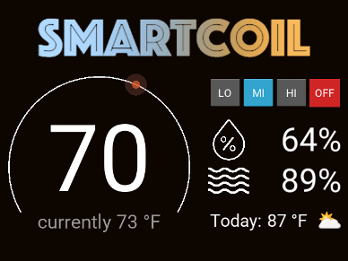
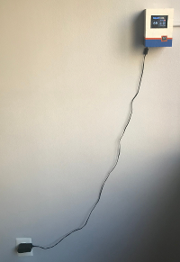
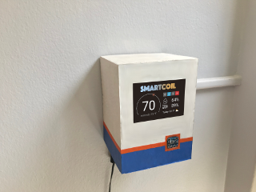
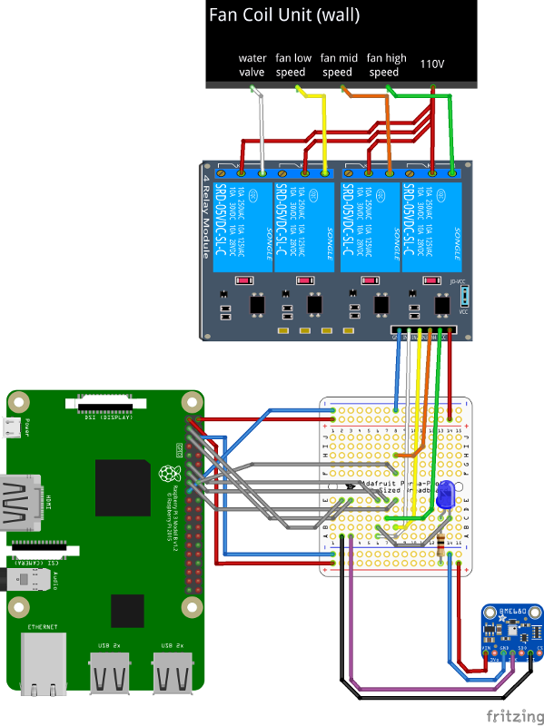
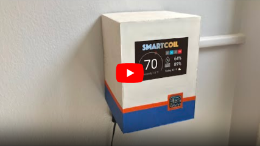

# SmartCoil

[](https://www.python.org/)
[](https://www.raspberrypi.org/)
[](https://developer.amazon.com/alexa)

Full interface to automate a home-based fan coil unit with a Raspberry Pi.

**DISCLAIMER:** Notice that fan coil unit wiring may involve high voltage manipulation, any handling of this kind is under your own responsibility.

Pictures of the GUI and home-made case views are listed below.

[]() []() []()

This project is based in the following technologies:

- Kivy for GUI that allows temperature and fan speed manipulation through a PiTFT touch screen.
- BME680 sensor for current temperature, humidity and air quality information in the GUI.
- 4-channel relay module to control coil valve and fan states.
- Meteorologisk institutt weather API for additional information such as outdoors temperature and weather forecast in the GUI.
- Flask for server deployment + Pagekite for HTTPS tunneling to control the app through an Alexa Smart Home Skill.


## Physical configuration

The **BME680 sensor** is wired as follows:
- Pi 3V3 to sensor VIN
- Pi GND to sensor GND
- Pi SCL to sensor SCK
- Pi SDA to sensor SDI

The **4-channel relay module** is wired as follows:
- Pi 5V to module VCC
- Pi GND to module GND
- PI GPIO 17 to module IN1 (water valve control)
- PI GPIO 22 to module IN2 (fan lo-speed control)
- PI GPIO 23 to module IN3 (fan mi-speed control)
- PI GPIO 27 to module IN4 (fan hi-speed control)

For a graphic reference, refer to the schematic below.

[]()

## Amazon Alexa configuration
In order to use the Alexa portion of the project, you must build your own Alexa smart home skill. You could follow the official guide on [Steps to Build a Smart Home Skill](https://developer.amazon.com/docs/smarthome/steps-to-build-a-smart-home-skill.html) and use the code I implemented for my own skill, found in [here](https://github.com/amontilla0/smartcoil/blob/master/assets/alexa_nodejs/index.js).

Create a new account on [pagekite](https://pagekite.net/) (they have a free trial) to enable HTTPS tunneling and do the following configuration:
- In the index.js file for AWS lambda, update the constant ``tok`` with a unique secret token.
- In the project, rename server_config.json_template to server_config.json (located in assets/config) and assign the values ``tunnel``, ``port`` and ``token`` to the your new pagekite server, pagekite port and secret token created in the previous step, respectively.

## Database details
An internal SQLite database is used to store outdoor and indoor status for future data analysis.
The items stored in the DB are:
- Temperature, humidity, air pressure, gas resistance and air quality, coming from the BME680 sensor.
- Current state of the GUI such as target temperature and set fan speed.
- Latitude, longitude, outdoor temperature, humidity, pressure, forecast condition, wind speed, wind direction and precipitation percentage. All coming from the weather API.

## Installation and usage

For a quick run of the project, clone the repository and execute the commands below at the root directory. It is recommended to use a virtual environment created with ``virtualenv``.

```bash
pip install -r requirements.txt
python3 tests/main_test.py
```

# Additional resources
To see the SmartCoil in action, please refer to the following video:

[](https://www.youtube.com/watch?v=cOHOSmqagjc)

## License
[MIT](https://choosealicense.com/licenses/mit/)
